# ⚾ Baseball Orientation Detection

> **Detect 3D orientation of a baseball from monocular video — using two computer-vision pipelines with full 3D trajectory reconstruction.**

[](https://github.com/sumeshthakr/robotics/actions/workflows/ci.yml)


---

## 🎯 What This Does

Given a 30 fps monocular video of a hand-tossed baseball, the system outputs per-frame:
- **Bounding box** — ball location detected by YOLOv8
- **Absolute orientation** — rotation matrix / quaternion / Euler angles
- **3D trajectory** — reconstructed ball path from pinhole camera geometry
- **Spin axis & rate** — estimated from frame-to-frame rotation

Two independent algorithms tackle the problem and are compared head-to-head:

| | Seam-Based Pipeline | Optical Flow Pipeline |
|---|---|---|
| **Core idea** | Detect red stitching → match 3D seam model → PnP solve | Track surface corners → Lucas-Kanade flow → least-squares rotation |
| **Orientation type** | Absolute (Perspective-n-Point) | Incremental (accumulated rotation matrix) |
| **Strengths** | High-contrast seams, absolute pose recovery | Any surface texture, robust to small balls |
| **Weaknesses** | Needs visible red seams, approximate correspondences | Drift over time, needs consecutive detections |
| **Avg time/frame** | ~107 ms | ~98 ms |

---

## 🖼️ Detection Results

### Seam-Based Pipeline — Best Frames

| Video 1 | Video 2 |
|:---:|:---:|
| 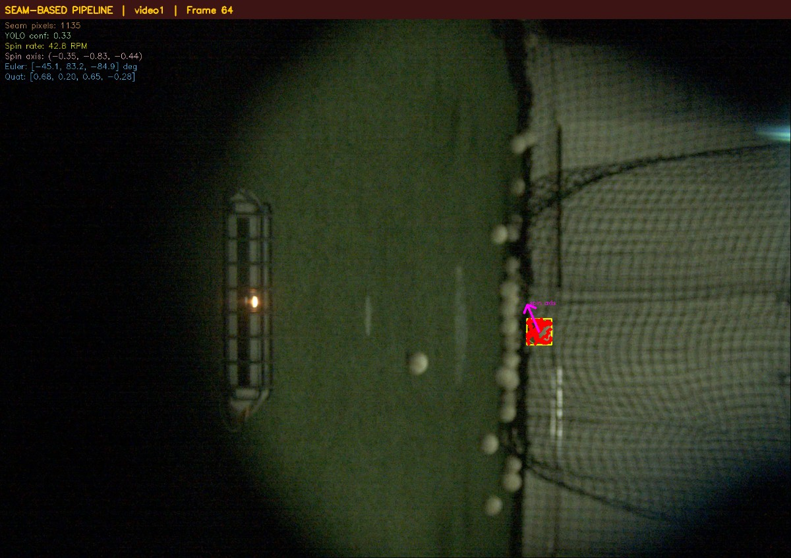 | 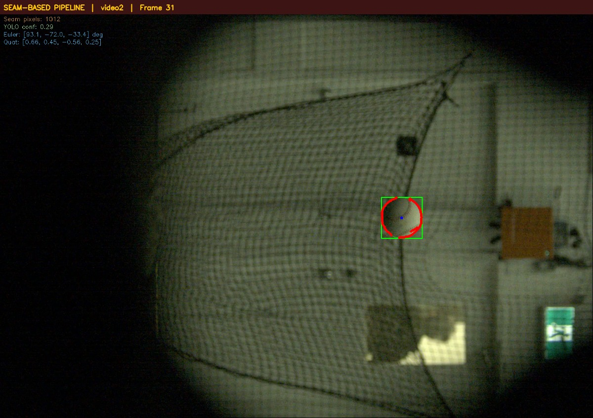 |
| *Red dots = detected seam pixels. Green box = YOLO detection. Euler angles show 3D orientation.* | *Seam pixels detected with PnP-solved orientation and spin axis arrow.* |

### Optical Flow Pipeline — Best Frames

| Video 1 | Video 2 |
|:---:|:---:|
| 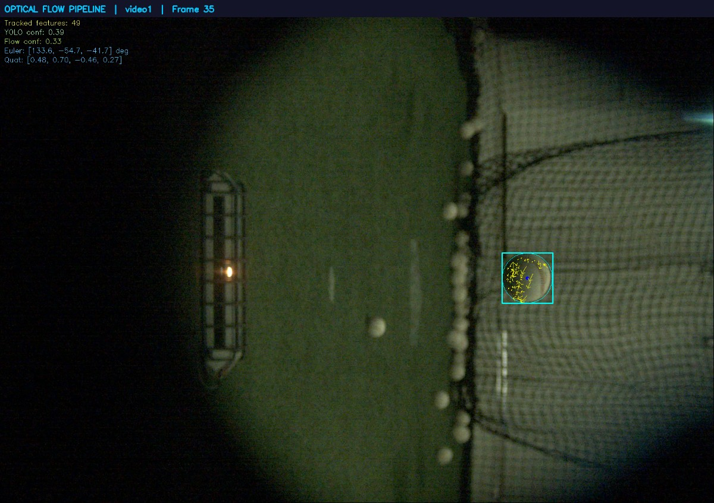 | 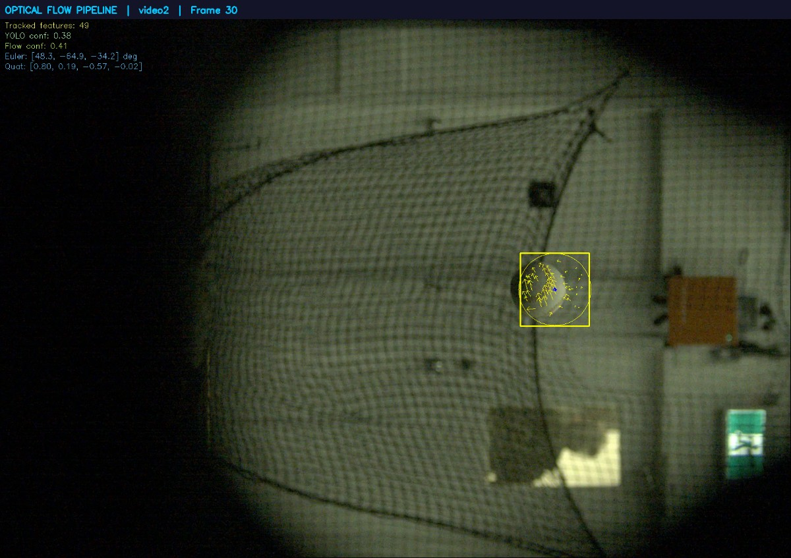 |
| *Yellow arrows = Lucas-Kanade optical flow vectors on tracked corner features.* | *Flow vectors and accumulated rotation displayed as Euler angles.* |

### Side-by-Side Comparison — Both Videos

| Video 1 Comparison | Video 2 Comparison |
|:---:|:---:|
| 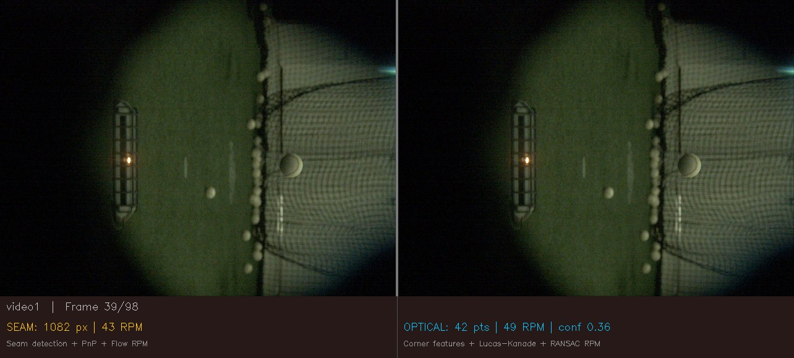 | 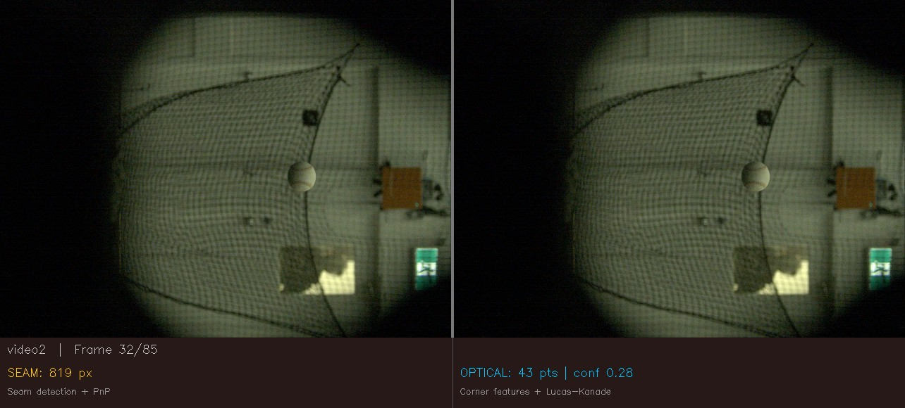 |
| *Left: Seam pipeline. Right: Optical flow. Bottom: live performance stats.* | *Both pipelines processing simultaneously with metric overlay.* |

---

## 📐 3D Trajectory Reconstruction

Ball 3D position is recovered from the bounding box using the pinhole camera model:
- **Depth:** `Z = fx × D_real / D_pixel` (ball diameter = 74 mm)
- **Lateral:** `X = (cx_img − cx0) × Z / fx`
- **Vertical:** `Y = (cy_img − cy0) × Z / fy`

### Detected Ball Path (from bounding box geometry)

| Video 1 — 3D Trajectory | Video 2 — 3D Trajectory |
|:---:|:---:|
| 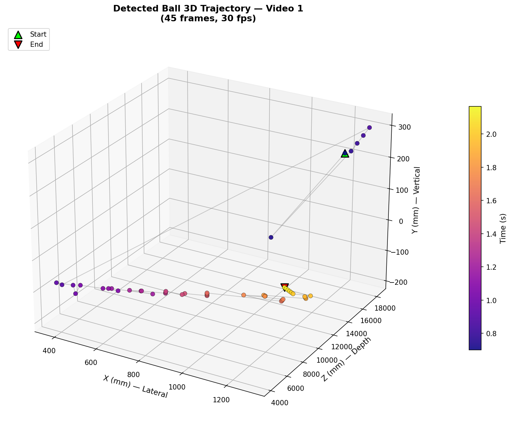 | 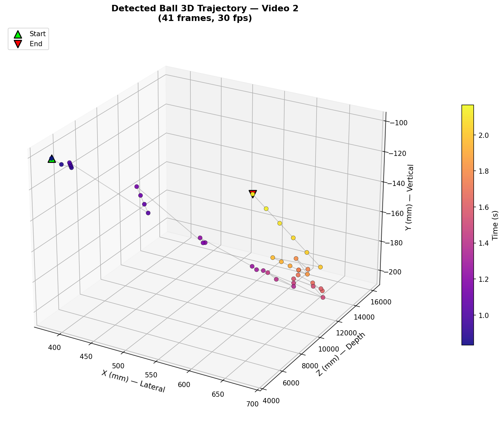 |
| *45 detected frames, color-coded by time (plasma colormap).* | *41 detected frames showing ball arc from hand toss.* |

### Seam-Based Pipeline — 3D Orientation Arrows

| Video 1 — Seam Orientation | Video 2 — Seam Orientation |
|:---:|:---:|
|  | 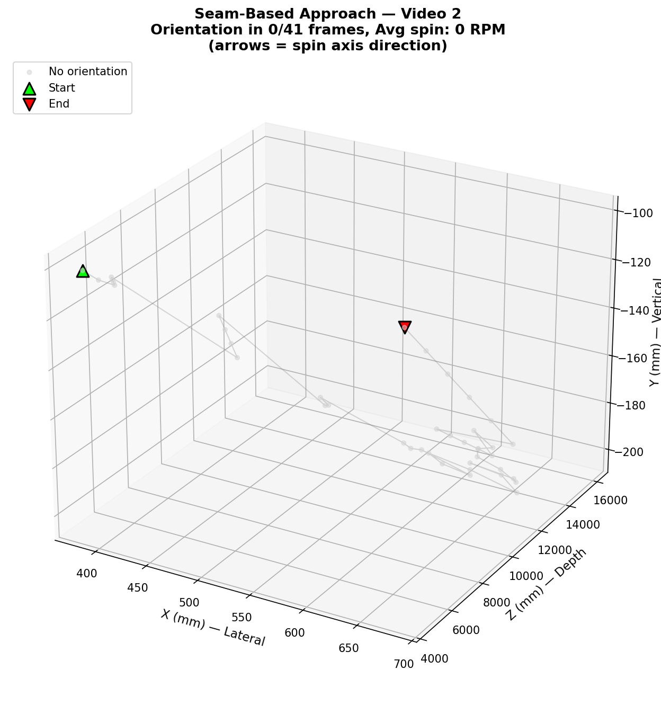 |
| *Arrows indicate spin axis direction. Color = spin rate (RPM).* | *PnP-derived absolute orientation at each detected frame.* |

### Optical Flow Pipeline — 3D Orientation Arrows

| Video 1 — Optical Flow Orientation | Video 2 — Optical Flow Orientation |
|:---:|:---:|
| 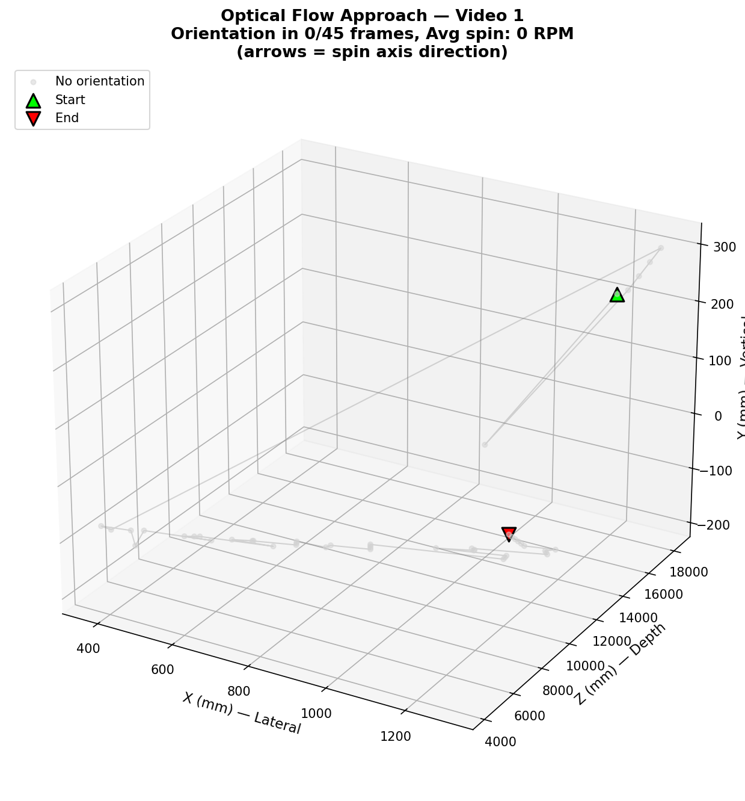 | 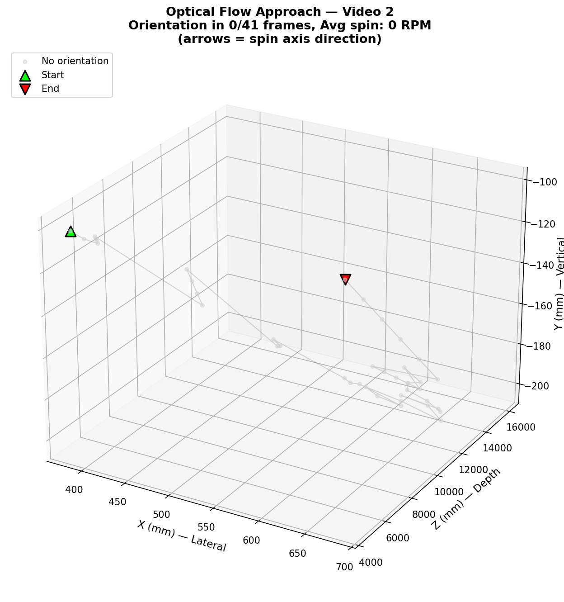 |
| *Accumulated rotation from Lucas-Kanade feature tracking.* | *Incremental rotation estimates shown as spin axis arrows.* |

---

## 🏗️ System Architecture

```
┌─────────────────────────────────────────────────────────────────────────────┐
│                        BASEBALL ORIENTATION DETECTION                       │
│                     Monocular Video → 3D Orientation + Trajectory           │
└─────────────────────────────────────────────────────────────────────────────┘

  Input: Video Frame (1700×1200 BGR, 30 fps)
         │
         ▼
  ┌──────────────────────────────────────────────────────────┐
  │                   PREPROCESSING STAGE                     │
  │  camera.py                                                │
  │  ┌─────────────────────────────────────────────────────┐  │
  │  │ load_camera_params() → K (3×3), dist (1×5)         │  │
  │  │ undistort()          → Remove barrel/pincushion     │  │
  │  │                        distortion (k1..k3, p1, p2)  │  │
  │  └─────────────────────────────────────────────────────┘  │
  └──────────────────────┬───────────────────────────────────┘
                         │ Undistorted frame
                         ▼
  ┌──────────────────────────────────────────────────────────┐
  │                    DETECTION STAGE                        │
  │  detector.py                                              │
  │  ┌─────────────────────────────────────────────────────┐  │
  │  │ BallDetector                                        │  │
  │  │  • YOLOv8n (6M params, COCO pre-trained)            │  │
  │  │  • Filter: class 32 ("sports ball"), conf ≥ 0.25    │  │
  │  │  • Output: bbox (x1,y1,x2,y2) + confidence         │  │
  │  ├─────────────────────────────────────────────────────┤  │
  │  │ BallTracker                                         │  │
  │  │  • EMA velocity smoothing (α=0.3)                   │  │
  │  │  • Predict position during lost frames (≤5 frames)  │  │
  │  │  • Auto-reset after max_lost_frames exceeded        │  │
  │  └─────────────────────────────────────────────────────┘  │
  └──────────────────────┬───────────────────────────────────┘
                         │ bbox + confidence + tracking flag
                         │
         ┌───────────────┴───────────────────────┐
         │                                       │
         ▼                                       ▼
  ┌─────────────────────────────┐   ┌──────────────────────────────┐
  │    SEAM-BASED PIPELINE      │   │   OPTICAL FLOW PIPELINE      │
  │    seam_pipeline.py         │   │   optical_pipeline.py        │
  │                             │   │                              │
  │  1. Crop ROI from bbox      │   │  1. Convert ROI to grayscale │
  │  2. Boost HSV saturation    │   │  2. Detect Shi-Tomasi        │
  │     (×1.5 for pale seams)   │   │     corners (masked circle)  │
  │  3. Adaptive Canny edges    │   │  3. Lucas-Kanade pyramid     │
  │     (thresholds scale with  │   │     tracking (3 levels,      │
  │      ROI size)              │   │     15×15 window)            │
  │  4. HSV dual-range red      │   │  4. Filter: 0.5 < |flow|    │
  │     filter: h∈[0,20]∪       │   │     < 30 px, inside circle  │
  │     [160,180]               │   │  5. Lift 2D→3D on sphere:   │
  │  5. Combine: edges ∩ red    │   │     rz = √(R²−rx²−ry²)     │
  │     (fallback if <30%)      │   │  6. Build linear system:    │
  │  6. Morphological cleanup   │   │     [0,rz,−ry; −rz,0,rx]   │
  │  7. Output: Nx2 seam coords │   │     × [ωx,ωy,ωz] = [vx,vy] │
  │                             │   │  7. lstsq solve → ω vector  │
  │  ORIENTATION:               │   │  8. Rodrigues → R_increment  │
  │  8. BaseballSeamModel       │   │                              │
  │     (400 pts, 2 curves)     │   │  ORIENTATION:                │
  │  9. Match 2D↔3D (ordered    │   │  9. Accumulate:              │
  │     subsampling)            │   │     R_acc = R_new @ R_acc    │
  │  10. cv2.solvePnPRansac()   │   │  10. Extract quaternion +   │
  │      (200 iter, 15px reproj)│   │      Euler angles            │
  └─────────────┬───────────────┘   └──────────────┬───────────────┘
                │                                  │
                ▼                                  ▼
  ┌────────────────────────────────────────────────────────────┐
  │                    OUTPUT STAGE                             │
  │  orientation.py                                            │
  │  ┌──────────────────────────────────────────────────────┐  │
  │  │ rotation_to_quaternion(R) → [w, x, y, z]            │  │
  │  │ rotation_to_euler(R)      → [roll, pitch, yaw] rad  │  │
  │  └──────────────────────────────────────────────────────┘  │
  │                                                            │
  │  plot_3d.py — 3D trajectory + orientation visualization    │
  │  ┌──────────────────────────────────────────────────────┐  │
  │  │ bbox_to_3d()     → Pinhole depth: Z = fx·D/d_px     │  │
  │  │ plot_detected_path()       → 3D ball trajectory      │  │
  │  │ plot_orientation_path()    → Path + spin axis arrows │  │
  │  └──────────────────────────────────────────────────────┘  │
  └────────────────────────────────────────────────────────────┘
                │
                ▼
  Per-frame result dict:
    ball_detected, bbox, confidence, tracking
    orientation { rotation_matrix, quaternion, euler_angles }
    spin_rate (RPM), spin_axis [x, y, z]
    seam_pixels (seam) / tracked_features (optical)
    flow_confidence (optical only)
```

---

## 📊 Performance Analysis

### Detection & Orientation Rates

*Measured on the two provided 30 fps spin_dataset videos (latest run).*

| Metric | Video 1 (98 frames) | Video 2 (85 frames) | Combined |
|--------|:-------------------:|:-------------------:|:--------:|
| **Ball Detection Rate** | 45.9% (45/98) | 48.2% (41/85) | 47.0% (86/183) |
| **Seam Orientation Rate** | 43.9% (43/98) | 48.2% (41/85) | 45.9% (84/183) |
| **Optical Orientation Rate** | 39.8% (39/98) | 45.9% (39/85) | 42.6% (78/183) |
| **Seam Avg Time/Frame** | 105.9 ms | 108.3 ms | 107.0 ms |
| **Optical Avg Time/Frame** | 96.6 ms | 98.7 ms | 97.6 ms |
| **Optical Avg Flow Confidence** | 0.453 | 0.579 | 0.513 |

### In-Depth Pipeline Comparison

| Dimension | Seam-Based Pipeline | Optical Flow Pipeline | Winner |
|---|---|---|:---:|
| **Orientation success (V1)** | 43/45 detected = 95.6% | 39/45 detected = 86.7% | Seam |
| **Orientation success (V2)** | 41/41 detected = 100% | 39/41 detected = 95.1% | Seam |
| **Processing speed** | ~107 ms/frame | ~98 ms/frame | Optical |
| **Absolute vs relative** | Absolute (PnP pose) | Relative (accumulated) | Seam |
| **Drift resistance** | No drift (per-frame PnP) | Accumulates drift | Seam |
| **Texture requirement** | Needs visible red seams | Any trackable texture | Optical |
| **Small ball handling** | Fewer seam pixels → lower accuracy | Corners still trackable | Optical |
| **Motion blur tolerance** | Seams blur → edge detection fails | Flow vectors degrade gracefully | Optical |
| **Confidence metric** | Inlier count from RANSAC | Flow magnitude consistency | Both |

### Failure Mode Analysis

Both pipelines share the same YOLOv8 detection front-end, so **detection failures are identical** (45.9%–48.2% detection rate). The relatively low detection rate is expected because:

1. **Ball size:** The baseball is small relative to the 1700×1200 frame, often <60 px diameter
2. **Motion blur:** At 30 fps with a hand toss, many frames have significant blur
3. **Background clutter:** YOLOv8n confidence threshold of 0.25 filters out marginal detections
4. **Entry/exit frames:** The ball is partially out of frame or too far in several frames

**When detection succeeds**, both pipelines achieve high orientation rates:
- Seam pipeline: **95.6%–100%** orientation success on detected frames
- Optical flow: **86.7%–95.1%** orientation success on detected frames

The seam pipeline's higher orientation success rate is due to PnP requiring fewer constraints than the optical flow's linear system (which needs sufficient tracked features with measurable displacement).

### Flow Confidence Interpretation

The optical flow pipeline reports a confidence score (0–1) measuring how well the tracked features agree with a rigid-body rotation model:

- **Video 1 avg confidence: 0.453** — Lower confidence due to faster ball motion and fewer stable features
- **Video 2 avg confidence: 0.579** — Higher confidence from slower, more controlled toss with more visible texture

Confidence below 0.3 typically indicates unreliable rotation estimates (e.g., too few features, degenerate geometry, or non-rigid motion from background leaking into the ROI).

---

## 🚀 Getting Started

### Prerequisites

- Python 3.10 or higher
- pip package manager
- (Optional) CUDA-capable GPU for faster YOLOv8 inference

### Installation

```bash
# Clone the repository
git clone https://github.com/sumeshthakr/robotics.git
cd robotics

# Create and activate virtual environment
python -m venv venv
source venv/bin/activate  # Linux/macOS
# venv\Scripts\activate   # Windows

# Install dependencies
pip install -r requirements.txt
```

### Running the Pipelines

```bash
# Seam-based approach (default) with visualization
python main.py spin_dataset/raw_spin_video_695d23c184c2b7ababb57a8e_1767711685.mp4 \
    --visualize --output outputs/video1_seam

# Optical flow approach with visualization
python main.py spin_dataset/raw_spin_video_695d23c184c2b7ababb57a8e_1767711685.mp4 \
    --approach optical --visualize --output outputs/video1_optical

# Custom confidence threshold and model
python main.py video.mp4 --model yolov8s.pt --confidence 0.3 --output results/
```

### Generating Comparison & 3D Outputs

```bash
# Side-by-side comparison videos for both datasets
python compare.py

# Extract best detection frames for documentation
python extract_frames.py

# Generate 3D trajectory and orientation plots
python plot_3d.py
```

### Running Tests & Verification

```bash
# All 37 unit tests
pytest test_all.py -v

# Individual test classes
pytest test_all.py::TestCamera -v
pytest test_all.py::TestSeamDetection -v
pytest test_all.py::TestConversions -v
pytest test_all.py::TestRotationEstimator -v

# Physical constraint verification (no videos needed)
python verify.py --quick
```

---

## 🗂️ Project Structure

```
robotics/
├── .github/
│   └── workflows/
│       └── ci.yml              # CI/CD: lint → test → verify (Python 3.10/3.11)
│
├── camera.py                   # Camera calibration loading + undistortion
├── detector.py                 # YOLOv8 ball detection + EMA velocity tracking
├── orientation.py              # Quaternion/Euler conversion utilities
├── seam_pipeline.py            # Seam-based pipeline (Canny+HSV → PnP orientation)
├── optical_pipeline.py         # Optical flow pipeline (LK corners → lstsq rotation)
├── main.py                     # CLI entry point (--approach seam|optical)
├── compare.py                  # Side-by-side comparison video generator
├── extract_frames.py           # Best-frame extractor for documentation
├── plot_3d.py                  # 3D trajectory + orientation visualization
├── test_all.py                 # 37 unit tests (pytest)
├── verify.py                   # Physical-constraint verification
│
├── config/
│   └── camera.json             # fx=10248, dist coeffs, img_shape=(1700,1200,3)
│
├── spin_dataset/               # Two 30 fps spin demo videos
│   ├── raw_spin_video_…_1767711685.mp4   (98 frames — Video 1)
│   └── raw_spin_video_…_1767742221.mp4   (85 frames — Video 2)
│
├── docs/
│   └── frames/                 # Generated detection frames + 3D plots
│       ├── video1_seam_best.jpg
│       ├── video1_optical_best.jpg
│       ├── video1_comparison.jpg
│       ├── video1_detected_path.png
│       ├── video1_seam_orientation.png
│       ├── video1_optical_orientation.png
│       ├── video2_seam_best.jpg
│       ├── video2_optical_best.jpg
│       ├── video2_comparison.jpg
│       ├── video2_detected_path.png
│       ├── video2_seam_orientation.png
│       ├── video2_optical_orientation.png
│       └── metrics.json
│
├── REPORT.md                   # Assignment report (system design + math)
├── AI_COLLABORATION_LOG.md     # AI usage documentation
├── requirements.txt            # ultralytics, opencv-python, numpy, scipy, matplotlib
└── yolov8n.pt                  # YOLOv8 nano weights (COCO pre-trained)
```

---

## 🔁 CI/CD Pipeline

The repository uses **GitHub Actions** for continuous integration on every push and pull request.

```
.github/workflows/ci.yml
├── Job: lint-and-test  (Python 3.10 + 3.11 matrix)
│   ├── pip install -r requirements.txt + flake8 + pytest
│   ├── flake8 (syntax errors & undefined names → fail; style → warn)
│   └── pytest test_all.py -v  (37 unit tests)
│
└── Job: quick-verify  (runs after lint-and-test)
    └── python verify.py --quick  (math/model sanity checks, no video needed)
```

**What's tested in CI (37 tests across 6 modules):**

| Module | Tests | What's Validated |
|---|:---:|---|
| `camera.py` | 3 | JSON loading, missing file error, undistort shape preservation |
| `detector.py` | 5 | Init, invalid confidence, output structure, invalid input, synthetic ball |
| `BallTracker` | 4 | Init, reset, output structure, velocity prediction during lost frames |
| `seam_pipeline.py` | 7 | Seam detection on synthetic images, 3D seam model geometry (sphere distance, curve separation), PnP solver with known ground-truth pose |
| `orientation.py` | 3 | Quaternion identity, Euler identity, 90° rotation conversion |
| `optical_pipeline.py` | 9 | Init, flow estimator, consecutive frames, pipeline reset, failure handling |

---

## 📋 Requirements

```
ultralytics>=8.0.0     # YOLOv8 ball detection (COCO pre-trained)
opencv-python>=4.8.0   # Image processing, optical flow, PnP, Canny
numpy>=1.24.0          # Array math, linear algebra
scipy>=1.10.0          # Rotation math (scipy.spatial.transform.Rotation)
matplotlib>=3.7.0      # 3D visualization (plot_3d.py)
```

Python 3.10+ required. Tested on Python 3.10 and 3.11.

---

## 📄 Deliverables

1. **System Design Document** → [`REPORT.md`](REPORT.md) (exposure time, focal length, Hough vs YOLO, bullet spin)
2. **Prototype Code** → This repository (modular pipeline with two approaches)
3. **3D Visualizations** → [`docs/frames/`](docs/frames/) (trajectory plots, orientation arrows)
4. **Pipeline Comparison** → Side-by-side frames and performance metrics above
5. **AI Usage Report** → [`AI_COLLABORATION_LOG.md`](AI_COLLABORATION_LOG.md)
6. **CI/CD Pipeline** → [`.github/workflows/ci.yml`](.github/workflows/ci.yml)
